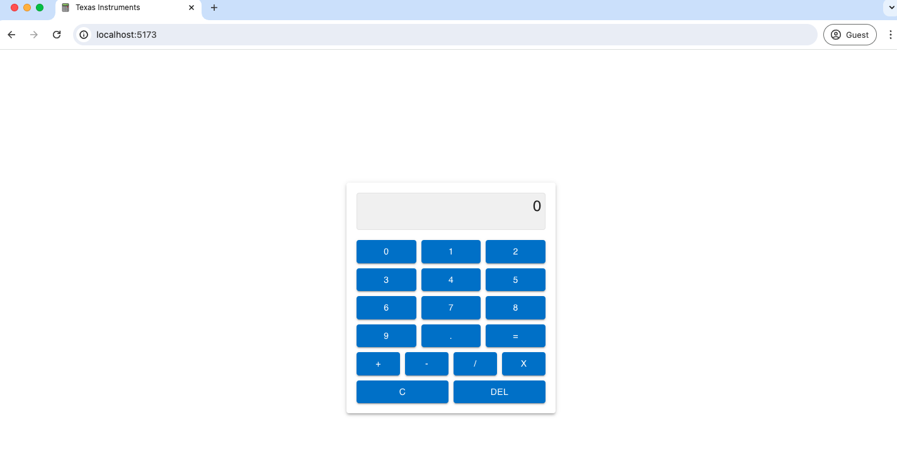

# React calculator

## Bootstrapped with Vite React + TS
1. `npm install`
2. `npm run dev`

###
Some improvements with more time:
1. better state management. maybe use a reducer, which would make it unit testable.
